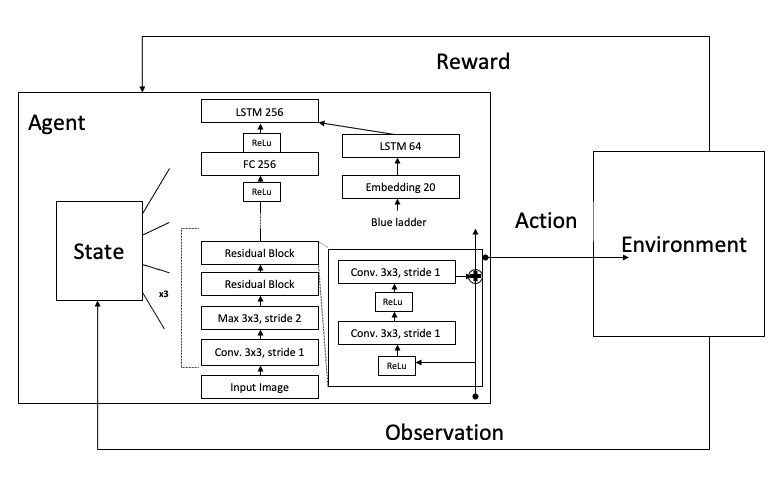

# Autonomous-Driving-using-Reinforcement-Learning

Utilizing the Unity engine with the ML-Agents API, I compared state of the art reinforcement learning algorithms and several different neural networks to see which combinations of algorithms and neural networks worked best for autonomous driving in a Unity virtual environment.

## Background Information
### What is an Autonomous Vehicle?
Essentially an autonomous vehicle (AV) is a vehicle capable of sensing its environment and operating without human involvement.

### Why is Autonomous Driving Important?
* Safer Roads: According to data from the Department of Transportation, about 94% of car accidents are due to human error. Higher levels of autonomy have the potential to reduce risky and dangerous driver behaviors.
* Accessibility for all: people with disabilities, such as the blind, will become capable of self-sufficiency, and highly automated vehicles(HAV’s) can help them live a better life.
* More time: in a fully automated vehicle, all occupants could safely pursue more productive or entertaining activities, like responding to emails or watching a movie. 

### Who's Leading the race to Autonomous Driving?
There are many different companies working on autonomous driving software, however, according to analyticsinsight, the leading contenders are google’s Waymo project, Argo AI who is sponsored by Ford Motors, Tesla, General Motors, and China’s Baidu.

## Project Set Up
* Unity Engine: Unity Software Inc. is an American video game software company based in San Francisco. For this Project I used [Unity Version 2020.1.17f1](https://unity.com/releases/2020-1)
* ML-Agents API: The ML-Agents Python package contains 2 components:
  * A low level API which allows you to interact directly with a Unity Environment.
  * An entry point to train which allows you to train agents.
  * Goto the [ML-Agents](https://github.com/Unity-Technologies/ml-agents) GitHub for Installation Instructions
  
 ## Quick Overview of Reinforcement Learning
 Reinforcement Learning for computers can be thought of the same way reinforcement learning works in psychology; where you have an **agents** who performs an **action** inside of an **environment**. Then depending on what the agent does compared to what it's supposed to do, it will recieve a **reward**, either positive or negative. It will also recieve an **observation** of the next state, you can look at the observation as the agent's eyes, then beings processed by the neural networks (the brain) to help the agent make it's next action to optimize it's reward. 
 
 
 
