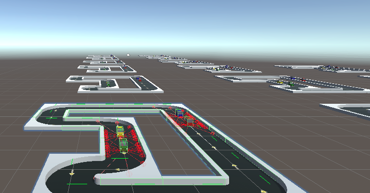
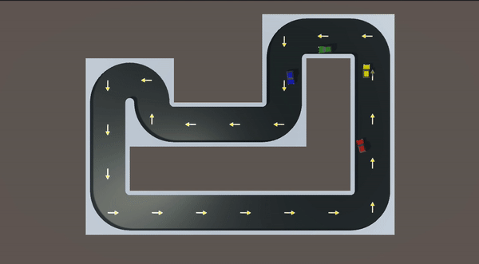
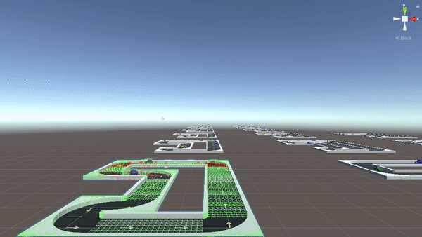

# Autonomous-Driving-using-Reinforcement-Learning

Utilizing the Unity engine with the ML-Agents API, I compared state of the art reinforcement learning algorithms and several different neural networks to see which combinations of algorithms and neural networks worked best for autonomous driving in a Unity virtual environment.

## Background Information
### What is an Autonomous Vehicle?
Essentially an autonomous vehicle (AV) is a vehicle capable of sensing its environment and operating without human involvement.

### Why is Autonomous Driving Important?
* Safer Roads: According to data from the Department of Transportation, about 94% of car accidents are due to human error. Higher levels of autonomy have the potential to reduce risky and dangerous driver behaviors.
* Accessibility for all: people with disabilities, such as the blind, will become capable of self-sufficiency, and highly automated vehicles(HAV’s) can help them live a better life.
* More time: in a fully automated vehicle, all occupants could safely pursue more productive or entertaining activities, like responding to emails or watching a movie. 

### Who's Leading the race to Autonomous Driving?
There are many different companies working on autonomous driving software, however, according to analyticsinsight, the leading contenders are google’s Waymo project, Argo AI who is sponsored by Ford Motors, Tesla, General Motors, and China’s Baidu.

## Project Set Up
* Unity Engine: Unity Software Inc. is an American video game software company based in San Francisco. For this Project I used [Unity Version 2020.1.17f1](https://unity.com/releases/2020-1)
* ML-Agents API: The ML-Agents Python package contains 2 components:
  * A low level API which allows you to interact directly with a Unity Environment.
  * An entry point to train which allows you to train agents.
  * Goto the [ML-Agents](https://github.com/Unity-Technologies/ml-agents) GitHub for Installation Instructions
  
 ## Quick Overview of Reinforcement Learning
 Reinforcement Learning for computers can be thought of the same way reinforcement learning works in psychology; where you have an **agents** who performs an **action** inside of an **environment**. Then depending on what the agent does compared to what it's supposed to do, it will recieve a **reward**, either positive or negative. It will also recieve an **observation** of the next state, you can look at the observation as the agent's eyes, then beings processed by the neural networks (the brain) to help the agent make it's next action to optimize it's reward. 
 
 
 
## Agent
So I set up my agent (car) with Ray Perception Sensors to simulate LiDAR sensors. My set up was the following:
* 8 rays per direction
* 180° coverage
* Ray length of 20
* Sphere cast radious of 0.5

 

## Training Environment
My training environment was set to 4 agents per training instance (4 cars per track) with 15 training instances to cut down on training time.

 

## Training
So my actual training consisted of the following: 
* 5 Million Steps
* 15+ different combinations of Deep Reinforcement Learning algorithms and Neural Networks
* Reinforcement Learning Algorithms:
 * Proximal Policy Optimization (PPO)
 * Soft Actor-Critic (SAC)
* Neural Networks:
 * 2 & 3 lay Multilayer Perceptions (MLP)
 * Convolutional Neural Network (CNN)
 * IMPALA Residual Neural Network (ResNet) with 3 convolutional layers
 * Memory Enhanced Recurring Neural Network (RNN)
 
*Note: I only posted top 4 models with the PPO algorithm and top model with SAC algorithm in training statistics*
 

## Testing Multiple Models Together
So I decided to test my models in 2 phases:
* First by Testing the models on a different environment to see how they reacted to new turns, new layout, more vehicles, etc.
* Second, I testing the models to see how they would interact with eachother. So I set each agent with a different model to evaluate performance.

## Conclusions
* Neural Network: Overall IMPALA ResNet seemed to outperform the other combinations of Neural Networks and Reinforcement Learning algorithms.
* Reinforcement Learning Algorithms: For every single case, the PPO algorithm outperformed the SAC algorithm.
* Deduction: By combining the IMPALA ResNet with the PPO algorithm is was shown to outperform all other attempted combinations

## Next Steps
* Environment: I plan to develop new and different style environments to train models on.
* Obstacles: I would like to increase the number of objects for the vehicle to take into account when driving (i.e. people, traffic lights, right aways, etc.)
* Computer Vision: Implement an Object Detection component to the Autonomous Vehicles
* More Training!: Apply more training time for models to become more and more accurate and safe.
